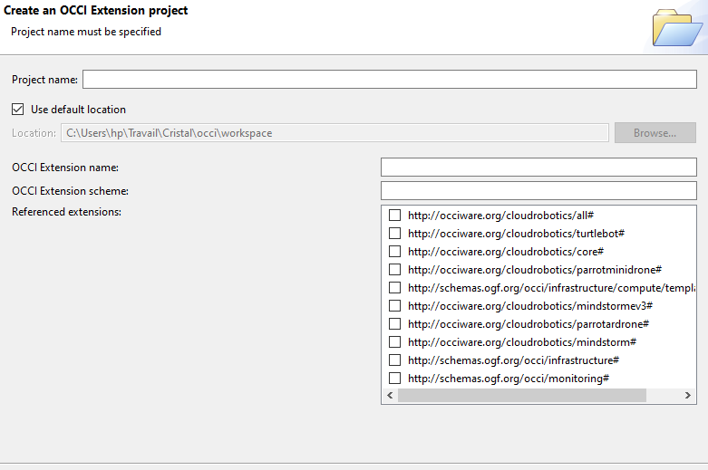
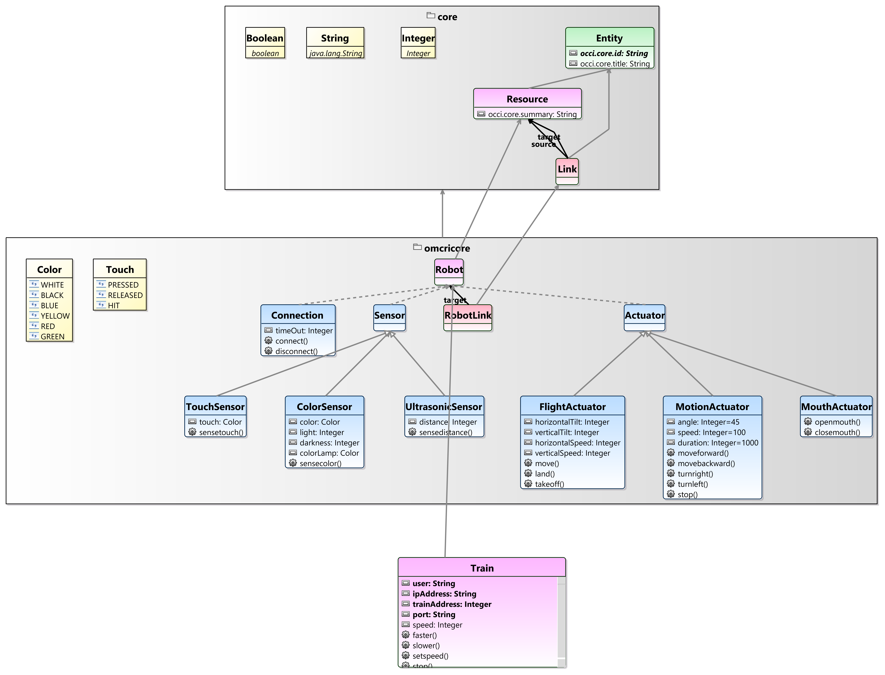
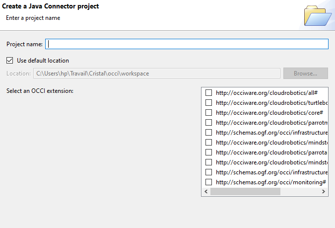

# Omcri4cp : Train DCC

Ce guide montre les étapes de construction de l'extension omcri pour les trains DCC de la plateforme portuaire.

## Extension sous eclipse

Les étapes suivantes permettent de créer l'extension pour les trains DCC.

1. Créer une nouvelle extension sous omcri studio

Ouvrir OMCRI Studio et dans *File->New->OCCI Studio* sélectionner **OCCI Extension Project**

Renseigner les informations suivantes

* Project Name : *omcri4cp.train*
* OCCI Extension name : *Train*
* OCCI Extension scheme : *http://cristal.org/omcri4cp/train#*

Dans la sections *Referenced extensions*, cocher la case *http://occiware.org/cloudrobotics/core#*

2. Ajouter un kind qui hérite de robot en spécifiant les attributs et les actions.

    * Ajouter un kind au diagramme en faisant un glisser déposer depuis category. 
    * Dans les propriétés du Kind, changer le *name* en *Train*. 
    * Ajouter une rélation parent entre **Train** et **Robot**.
    * Ajouter les attributs et les actions du **Train**

Les attributs à ajouter sont :

    user:String // L'utilisateur du train
    ipAddress:String // L'adresse ip du serveur
    trainAddress:Integer // L'adresse du train à commander ; compris entre 0 et 255
    port:Integer: // Le port de communication client serveur

Les actions en implémenter sont :

    start() // Fonction qui permet de mettre en marche le train avec la vitesse spécifié dans l'attribut speed.
    faster() // Fonction qui permet d'augmenter la vitesse de 1.
    slower() // Fonction qui permet de diminuer la diminuer la vitesse de 1
    setSpeed() // Fonction qui permet de mettre à jour la vitesse avec la valeur spécifiée par l'attribut speed.
    stop() // Fonction pour arrêter le train

On obtient le diagramme ci-dessous :

3. Générer les différents classes

Clique droit sur train.occie (*omcri4cp.train->model->train.occie*); dans OCCI-Studio, sélectionner **Generate EMF Tooling**.

Les classes générées sont dans le dossier source **src-gen**.

4. Générer la documentation si nécessaire

Clique droit sur train.occie (*omcri4cp.train->model->train.occie*); dans OCCI-Studio, sélectionner Generate **Generete Latex documentationn** ou **Generate Textile documentation**.

5. Créer un connecteur java

Dans *File->New->OCCI Studio*, sélectionner **Java Connector Project** 

Renseigner le nom du projet ; Project name : *omcri4cp.train.connector*. Ensuite sélectionner l'OCCI Extension correspondante : http://cristal.org/omcri4cp/train#.

6. Importer le .jar dans le connecteur

    * Créer un dossier lib à la racine du connecteur java
    * Copier coller le .jar dans ce dossier

7. Déclarer le .jar dans le MANIFEST

Dans le dossier **META-INF** du connecteur, ouvrir le fichier MANIFEST.MF. Aller dans **Runtime**, dans la section **classpath**, cliquer sur ***Add***. Dans la fenêtre qui s'affiche, sélectionner le .jar dans le dossier lib crée précedemment puis appuyer sur ok.

8. Implémenter les actions dans la classe train

Dans le dossier source **src-gen**, ouvrir le fichier ***TrainConnector.java*** et le compléter.

### ***Code Source***

## Client TCP

Le client est écrit en java et sera utiliser par le connecteur de l'extension sous omcri.

### ***Code source***

## Serveur TCP

Le serveur est écrit en python et doit être lancé sur la raspberry pi connectée au contrôleur des trains DCC.

### Installation des bibliothèques

Les biblithèques **speedlib** et **dccpi** sont nécessaires pour faire fonctionner correctement le serveur.

Installation de speedlib :

    pip3 install speedlib

Installation de dccpi :

    pip3 install dccpi

### ***Code source***

## Test sous eclipse

1. Générer un design et le lancer comme application eclipse

2. Créer un projet de test

## Test avec MartServer

Déclarer les .jar comme dépendences pour MartServer.

Lancer MartServer avec OCCInterface

